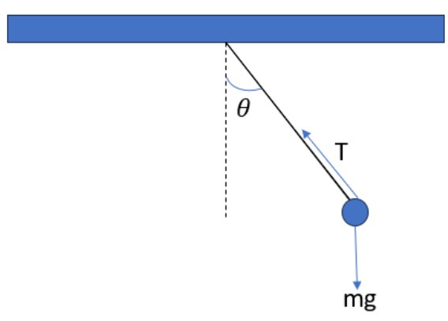
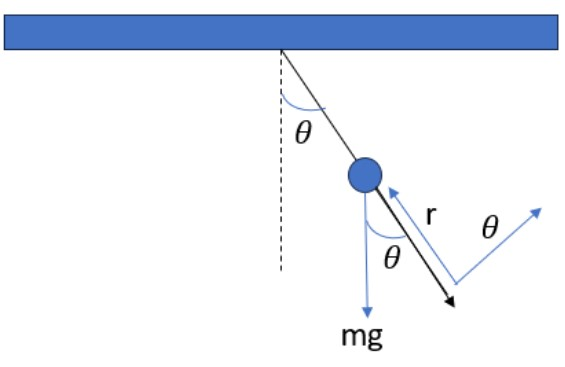

# **Pendulum With Drag**

In a simple pendulum we have a periodic movement, that is, a movement that goes and returns. If we drew the force diagram of the movement, we would have something like this:



When we talk about a simple pendulum, we mean that the angle {math}`\theta` is never greater than {math}`sin(15°)`, so this implies that {math}`sin(\theta) ≈ \theta` so we do not have a chaotic movement, as we will see a case later. If we wrote Newton's equations for this movement we would have:

```{math}
\sum F_{x} = -Tsen(\theta) = m \frac {d^2x}{dt^2}

\sum F_{y} = Tcos(\theta) - mg = m \frac {d^2y}{dt^2}
```

As we see here, we have two equations to solve a system with three unknowns. This system becomes very ineffective and complex to solve, so the easiest solution is to **translate the system to polar coordinates**. To take a good look at how the movement would be described in polar coordinates, let's look at the following image:



If we were to write Newton's equations for this "new system", we would have:

```{math}
\sum F_{r} = T - mgcos(\theta) = m\frac {d^2 r}{dt^2}

\sum F_{\theta} = -mg sin(\theta) = m \frac {dv_{\theta}}{dt}
```

If we look at the image we can see that {math}`r` is the length of the string, so its derivative is a constant so it is {math}`0`. In addition, the equation of the sum of forces in {math}`\theta` can be described in a different way since the speed in this movement would be given by: {math}`r \frac {d\theta}{dt}`
then the equations are described as follows:

---
```{math}
T-mgcos(\theta) = 0

T = mgcos(\theta)

\frac {d^2\theta}{dt^2} = \frac {-g}{l} sen(\theta)
```
---

And these would be the equations that we must solve numerically.

In this paper, the pendulum equation will be solved in four cases:

1. Simple pendulum with Euler's method (this is  for {math}`\theta \leq 15°`)
2. Simple pendulum with the Euler-Cromer method (that is, for {math}`\theta \leq 15°`)
3. Friction Pendulum (for large {math}`\theta` values)


### **Simple Pendulum with Euler**

For this case:

```{math}
\frac {d^2\theta}{dt^2} = \frac {-g}{l} \theta
```

Numerically:

```{math}
\omega_{i+1} = \omega_{i} - Δt(\frac {g}{l} \theta_{i})
```

```{theta}
\theta_{i+1} = \theta_{i} + \omega_{i} Δt 
```

This is:

```
#Import Libraries
import numpy as np
import matplotlib.pyplot as plt
```

```
g = 9.8; theta = [0.1]; w = [0]; l = 1
time = np.linspace(0, 10, 200)

for i in range(len(time)-1):
  w.append(w[i] - g/l * theta[i] * time[1])
  theta.append(theta[i] + w[i] * time[1])

plt.plot(time, theta)
plt.grid("--")
plt.title("Pendulum With No Drag Euler Method")
plt.xlabel("time")
plt.ylabel("theta")
```

### **Simple Pendulum with Euler-Cromer**

We have the same case above but numerically it is as follows:

```{math}
\omega_{i+1} = \omega_{i} - Δt(\frac {g}{l} \theta)

\theta_{i+1} = \theta_{i} + Δt (\omega_{i+1})
```
The code is:

```
g = 9.8; thetacromer = [0.2]; wcromer = [0]; l = 1

for i in range(len(time)-1):
  wcromer.append(wcromer[i] - g/l * thetacromer[i] * time[1])
  thetacromer.append(thetacromer[i] + time[1]*(wcromer[i+1]))

plt.plot(time, thetacromer, color="orange")
plt.grid("--")
plt.title("Pendulum With No Drag Euler-Cromer")
plt.xlabel("time")
plt.ylabel("theta")
```


